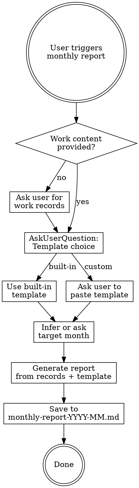

# Monthly Report Generator

## Overview

Generate a structured monthly work report from raw work logs/meeting notes. Supports built-in template or user-provided custom template. Output is a markdown file named `monthly-report-<YYYY>-<MM>.md`.

## When to Use

- User asks to write/generate a monthly report (月报, 月度报告, 月度工作总结)
- User provides raw work records and wants them summarized into a report
- User says "帮我写月报", "生成月报", "总结月度工作"

## Workflow



### Step 1: Collect Work Content

If user has not provided work records, ask them to provide detailed work logs for the month (meeting notes, daily/weekly records, etc.).

### Step 2: Template Selection

Use `AskUserQuestion` to let the user choose:

| Option | Description |
|--------|-------------|
| **使用内置月报模版** | Use the built-in template defined below |
| **输入自定义模版** | User pastes their own template for the report to follow |

If user chooses custom template, ask them to provide the template text.

### Step 3: Determine Target Month

- Infer from the work records (date range covered)
- If ambiguous, ask the user which month the report covers
- Format: YYYY-MM

### Step 4: Generate Report

**Key principles when generating:**

1. **Summarize, don't copy-paste** — Synthesize recurring themes across weeks; de-duplicate repeated items that appear in multiple weekly records.
2. **Two-level structure** — Write a concise executive summary (摘要) first, then detailed progress (详细进展) organized by work stream.
3. **Quantify results** — Include metrics, percentages, node counts, latency numbers wherever available in the source records.
4. **Highlight outcomes** — Lead with what was achieved/delivered, then mention ongoing/planned work.
5. **Preserve links** — Keep design doc URLs, PR links, and other references from source records.
6. **Professional tone** — Third-person or neutral voice, consistent with the template style.

### Step 5: Save

Save the generated report to: `monthly-report-<YYYY>-<MM>.md`

- `<YYYY>`: 4-digit year
- `<MM>`: 2-digit month (zero-padded)
- Example: `monthly-report-2026-05.md`

Save location: current working directory, or user-specified path.

## Built-in Template

The built-in template follows this structure:

```markdown
# <YYYY>/<MM> 月报

## <团队/项目名称>

### 摘要

- **工作方向1**：一段话概括本月该方向的关键进展与成果。
- **工作方向2**：一段话概括……
- ...（每个主要工作方向一个条目）

---

### 详细进展

#### 工作方向1

- **子项1**：具体进展描述，包含关键数据和结果。
- **子项2**：……
- 相关链接：[文档名](URL)

#### 工作方向2

- **子项1**：……

#### ...更多工作方向

```

**Template guidelines:**

- 摘要 section: Each bullet is one work stream, 2-4 sentences summarizing the month's highlights
- 详细进展 section: Organized by work stream, each with sub-items for specific accomplishments
- Use bold for sub-item titles within each section
- Include links to design docs, PRs, and other references
- Include quantitative data (performance numbers, node counts, coverage %) where available

## Common Mistakes

| Mistake | Fix |
|---------|-----|
| Copy-pasting weekly records verbatim | Synthesize and de-duplicate across weeks |
| Missing the 摘要 section | Always write executive summary first |
| Losing metrics/numbers from source | Preserve all quantitative data |
| Inconsistent granularity across sections | Keep similar depth for similar-importance work streams |
| Wrong filename format | Must be `monthly-report-YYYY-MM.md` with zero-padded month |
